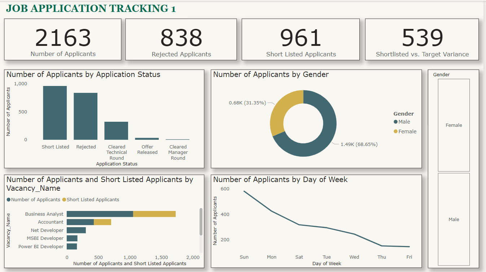
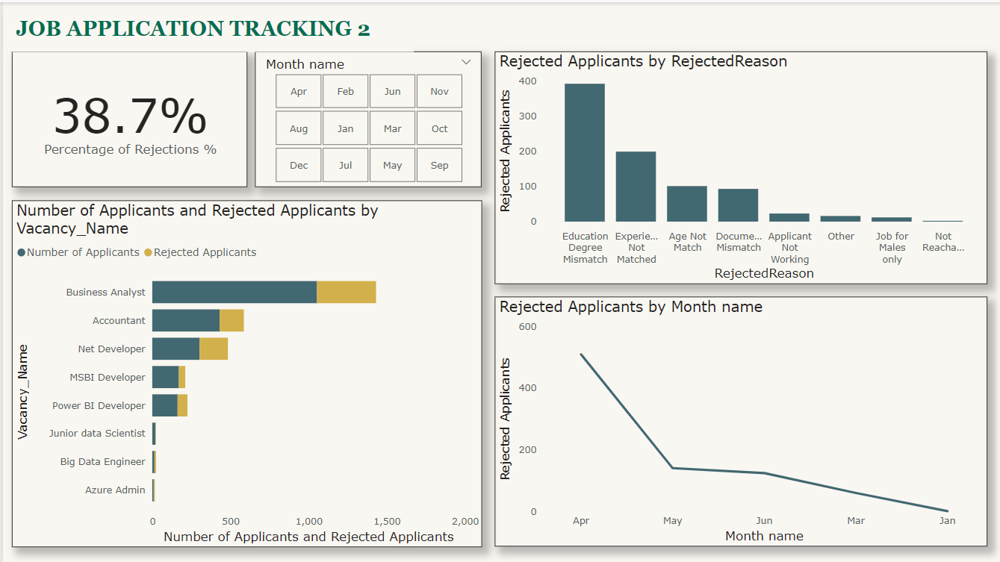
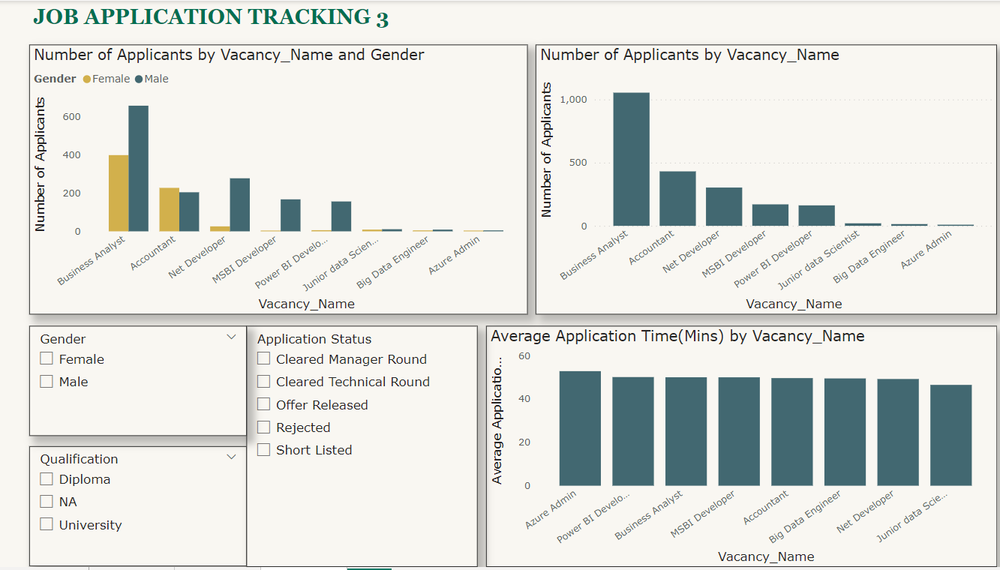

# W-Tech Job Application Tracking Analysis

## Introduction
This is a Job Application Tracking project I undertook using Power BI. This project allowed me to streamline and optimize the recruitment process, leading to valuable insights and recommendations that significantly improved recruitment strategies.
---

## Problem Statement

1. Build a dynamic dash board that connects recruitment data from different sources

2. Investigate strategies to attract and encourage a more diverse applicant pool, especially female candidates.

3. Examine the recruitment process to identify methods for achieving the shortlisting target of 1500 participants efficiently.

4. Assess job descriptions and qualifications to ensure they align with applicant expectations and reduce rejection rates due to education and degree mismatches.

## Operations performed

- Data collection
- Data cleaning
- Data transformation
- DAX
- Data visualization

## Modelling

The power BI feature was adjusted from automatically detecting relationships to manually performing the operation in order to remove and replace unwanted relationships with only required ones

The model is a star schema

There are four dimension tables and one fact table.  Three of the dimension tables are all joined to the fact table with a one-to-many relationship, while the application dimension table was joined by a one-to-one relationship

## Analysis/ Visualization

The report consists of three pages

## Job Application Tracking 1: Understanding the Applicant Pool

1. I began by examining the distribution of application statuses, revealing the breakdown of candidates who cleared the technical round, received job offers, or got rejected. This insight helped me gauge the efficiency of the early-stage recruitment process.
2. Analysed the gender field to understand the diversity of the applicant pool. Identifying gender distribution is a crucial step towards a more inclusive workplace.
3. HR set a goal of shortlisting 1500 participants. I tracked the progress against this target to check if it was on track.

## Job Application Tracking 2: Evaluating the Rejection Process

1. I calculated the percentage of rejections during the recruitment process, providing a clear measure of efficiency and candidate suitability.
2. Analysed rejection reasons, identifying whether rejections were based on education, degree, age mismatch, or other factors. This insight aided in pinpointing areas for improvement.
3. Tracked rejection trends over time to help understand whether the rejection rates are improving or worsening and make necessary adjustments

## Job Application Tracking 3: Efficiency and Qualification Analysis

1. Calculated the average time taken to apply for each vacant role, highlighting potential bottlenecks in the application process.
2. I analysed distribution of applications based on gender and qualification to enable a more effective recruitment strategy

## Insights and Recommendations

1. The analysis revealed that a significant number of applicants clear the technical round but face rejections later in the process. To improve efficiency, I recommended reviewing the criteria used for technical round clearance.
2. The gender distribution analysis revealed male applicants at 68.65% and female applicants at 31.35% indicating the need for improvement in attracting a more diverse applicant pool. To address this, I suggested launching targeted diversity recruitment campaigns.
3. The analysis revealed that HR's shortlisting target fell short by 539 candidates. To bridge this gap, I recommended refining the candidate sourcing methods, expanding the talent acquisition efforts, and optimizing the candidate evaluation criteria to identify more suitable candidates.
4. Rejection analysis showed that education and degree mismatches were prominent reasons for rejection. To mitigate this, I recommend revising job descriptions and qualifications to align with applicant expectations.

