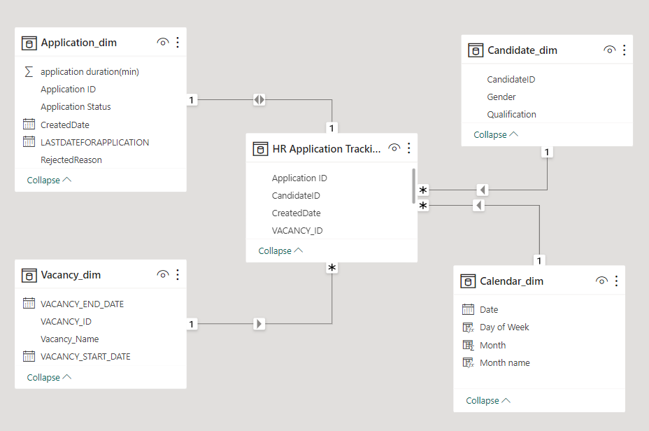

# W-Tech Job Application Tracking Analysis

## Introduction
This is a Job Application Tracking project I undertook using Power BI. This project allowed me to streamline and optimize the recruitment process, leading to valuable insights and recommendations that significantly improved recruitment strategies.
---

## Problem Statement

1. Build a dynamic dash board that connects recruitment data from different sources

2. Investigate strategies to attract and encourage a more diverse applicant pool, especially female candidates.

3. Examine the recruitment process to identify methods for achieving the shortlisting target of 1500 participants efficiently.

4. Assess job descriptions and qualifications to ensure they align with applicant expectations and reduce rejection rates due to education and degree mismatches.

## Operations performed

- Data collection
- Data cleaning
- Data transformation
- DAX
- Data visualization

## Modelling

The power BI feature was adjusted from automatically detecting relationships to manually performing the operation in order to remove and replace unwanted relationships with only required ones

The model is a star schema

There are four dimension tables and one fact table.  Three of the dimension tables are all joined to the fact table with a one-to-many relationship, while the application dimension table was joined by a one-to-one relationship

## Analysis/ Visualization

The report consists of three pages

## Job Application Tracking 1: Understanding the Applicant Pool

1. I began by examining the distribution of application statuses, revealing the breakdown of candidates who cleared the technical round, received job offers, or got rejected. This insight helped me gauge the efficiency of the early-stage recruitment process.
2. Analysed the gender field to understand the diversity of applicant pool. Identifying the gender distribution is a crucial step towards a more inclusive workplace.
3. HR set a goal of shortlisting 1500 participants. I tracked the progress against this target to check if its on track.

